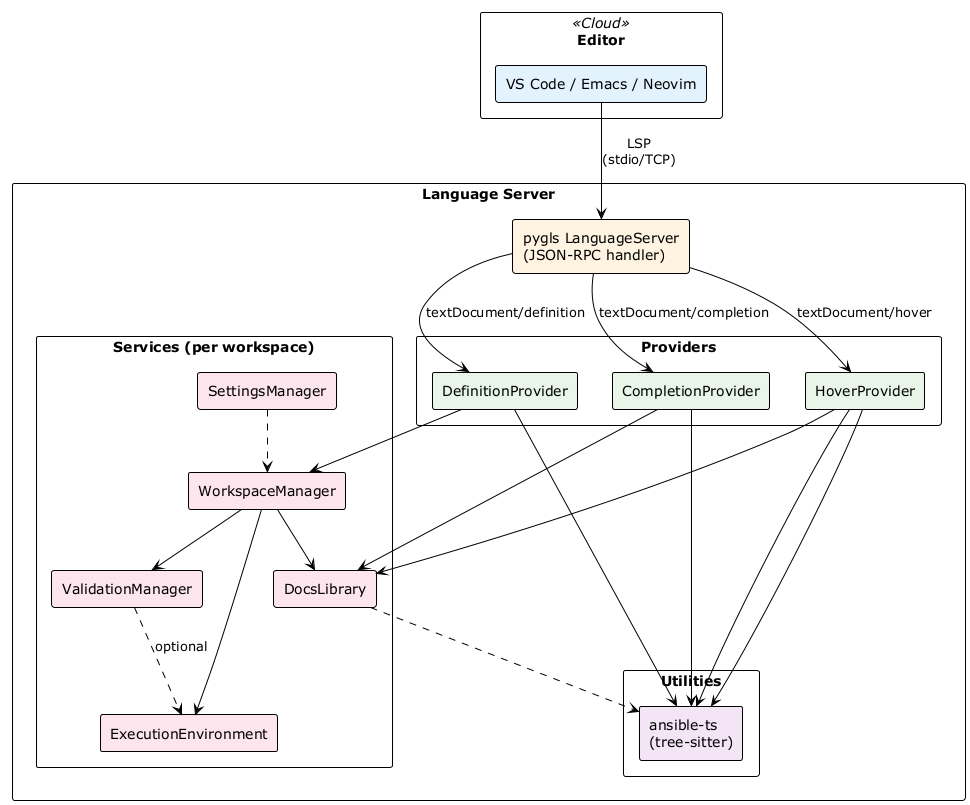
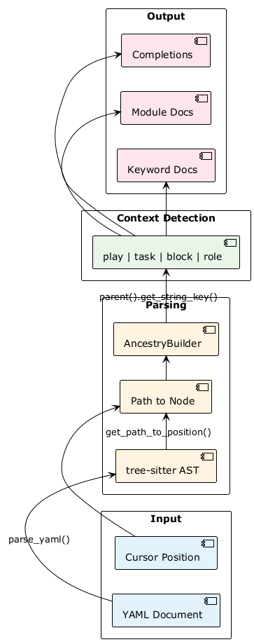
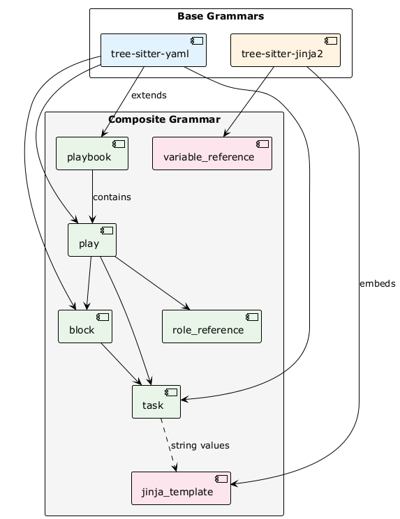
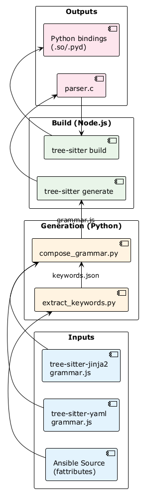

* ansible language server

** Implementation
:PROPERTIES:
:ID:       python-port-docs
:END:

The Python port of ansible-language-server aims to:

1. *Native Ansible Integration* - Import Ansible's internal APIs directly for keyword validation, module discovery, and documentation rather than reimplementing or shelling out
2. *Modern Tooling* - Use =tree-sitter= for fast, incremental YAML parsing with position tracking instead of slower pure-Python parsers
3. *Simplified Architecture* - Replace complex subprocess management with Python library calls (=podman-py=, =importlib.metadata=, =ansible-runner=)
4. *Better Developer Experience* - Format with =black=, lint with =ruff=, type-check with =mypy=, all working on Python code

*** TODO Architecture
:PROPERTIES:
:ID:       architecture
:END:

The server follows the standard Language Server Protocol architecture, built on [[https://github.com/openlawlibrary/pygls][pygls]]. For TypeScript codebase structure, see [[id:typescript-overview][TypeScript Codebase Overview]].

#+begin_src plantuml :file images/architecture.png :exports results
@startuml
!theme plain
skinparam packageStyle rectangle
skinparam componentStyle rectangle

package "Editor" <<Cloud>> {
  [VS Code / Emacs / Neovim] as client #e3f2fd
}

package "Language Server" {
  [pygls LanguageServer\n(JSON-RPC handler)] as pygls #fff3e0

  package "Providers" {
    [[[id:hover-provider][HoverProvider]]] as hover #e8f5e9
    [[[id:completion-provider][CompletionProvider]]] as completion #e8f5e9
    [[[id:definition-provider][DefinitionProvider]]] as definition #e8f5e9
  }

  package "Services (per workspace)" {
    [[[id:settings-service][SettingsManager]]] as settings #fce4ec
    [[[id:workspace-service][WorkspaceManager]]] as workspace #fce4ec
    [[[id:docs-library][DocsLibrary]]] as docs #fce4ec
    [[[id:validation-service][ValidationManager]]] as validation #fce4ec
    [[[id:container-management][ExecutionEnvironment]]] as execenv #fce4ec
  }

  package "Utilities" {
    [[[id:yaml-parsing][yaml_utils\n(tree-sitter)]]] as yaml #f3e5f5
    [[[id:ansible-keywords][ansible_keywords\n(hybrid)]]] as keywords #f3e5f5
  }
}

client -down-> pygls : LSP\n(stdio/TCP)
pygls -down-> hover : textDocument/hover
pygls -down-> completion : textDocument/completion
pygls -down-> definition : textDocument/definition

hover -down-> docs
hover -down-> yaml
hover -down-> keywords
completion -down-> docs
completion -down-> yaml
completion -down-> keywords
definition -down-> yaml
definition -down-> workspace

settings .down.> workspace
workspace -down-> docs
workspace -down-> validation
workspace -down-> execenv

docs ..> keywords
validation ..> execenv : optional
@enduml
#+end_src

#+RESULTS:

**** Data Flow

#+begin_src plantuml :file images/dataflow.png :exports results
@startuml
!theme plain
left to right direction
skinparam packageStyle rectangle

package "Input" {
  [YAML Document] as doc #e3f2fd
  [Cursor Position] as pos #e3f2fd
}

package "Parsing" {
  [tree-sitter AST] as tree #fff3e0
  [Path to Node] as path #fff3e0
  [[[id:ancestry-builder][AncestryBuilder]]] as ancestry #fff3e0
}

package "Context Detection" {
  [play | task | block | role] as ctx #e8f5e9
}

package "Output" {
  [Keyword Docs] as kw #fce4ec
  [Module Docs] as mod #fce4ec
  [Completions] as comp #fce4ec
}

doc -right-> tree : parse_yaml()
pos -right-> path
tree -right-> path : get_path_to_position()
path -right-> ancestry
ancestry -right-> ctx : parent().get_string_key()
ctx -right-> kw
ctx -right-> mod
ctx -right-> comp
@enduml
#+end_src

#+RESULTS:

**** Server Entry Point
:PROPERTIES:
:ID:       server-entry-point
:END:

=pygls= is the de-facto Python Language Server Protocol framework, providing full LSP spec compliance, native async/await support, and built-in document synchronization. The server entry point is minimal—pygls handles the protocol, we register feature handlers.

*TypeScript:* [[file:src/server.ts][src/server.ts]] (66 lines) creates a =Connection= and initializes =AnsibleLanguageService=.

*Python:*
#+begin_src python :tangle src/ansible_ls/server.py :mkdirp t
"""Ansible Language Server entry point."""

from pygls.server import LanguageServer

server = LanguageServer("ansible-language-server", "v0.1.0")

def main():
    """Start the language server."""
    server.start_io()

if __name__ == "__main__":
    main()
#+end_src

*** YAML Parsing
:PROPERTIES:
:ID:       yaml-parsing
:END:

For a language server that re-parses on every keystroke, we need:
- *Incremental parsing* - Only reparse changed regions
- *Error recovery* - Keep working with invalid YAML
- *Position tracking* - Map cursor to AST nodes

**** Why tree-sitter

| Feature             | tree-sitter-yaml               | ruamel.yaml             |
|---------------------+--------------------------------+-------------------------|
| Position Tracking   | Native (start/end points)      | Native (lc attrs)       |
| Incremental Parsing | *Yes*                          | No                      |
| Performance         | *C implementation*             | Pure Python             |
| Error Recovery      | *Partial parse on errors*      | Fails on invalid YAML   |

*TypeScript:* [[file:src/utils/yaml.ts][src/utils/yaml.ts]] (663 lines) uses the npm =yaml= package with custom AST traversal.

*Python:* We use =tree-sitter-yaml= which provides all three requirements. tree-sitter-yaml produces more wrapper nodes than npm =yaml=, so [[id:ancestry-builder][AncestryBuilder]] skips intermediate nodes during navigation.

#+begin_src python :tangle src/ansible_ls/utils/yaml_utils.py :mkdirp t
"""YAML AST utilities using tree-sitter.

Port of src/utils/yaml.ts
"""

from typing import Optional

import tree_sitter_yaml
from tree_sitter import Language, Parser

# Initialize tree-sitter YAML parser (tree-sitter 0.23+ API)
_language = Language(tree_sitter_yaml.language())
_parser = Parser(_language)

def parse_yaml(content: str) -> "tree_sitter.Tree":
    """Parse YAML content and return tree-sitter AST."""
    return _parser.parse(content.encode("utf-8"))

def get_node_at_position(tree, line: int, column: int):
    """
    Get the deepest node at the given line/column position.

    Args:
        tree: tree-sitter Tree object
        line: 0-indexed line number
        column: 0-indexed column number

    Returns:
        The deepest node containing the position, or None
    """
    root = tree.root_node
    point = (line, column)

    def walk(node):
        if node.start_point <= point <= node.end_point:
            for child in node.children:
                result = walk(child)
                if result:
                    return result
            return node
        return None

    return walk(root)

def get_path_to_position(tree, line: int, column: int) -> list:
    """
    Get the path from root to the node at position.

    Returns list of nodes from root to the deepest node.
    """
    root = tree.root_node
    point = (line, column)
    path = []

    def walk(node):
        if node.start_point <= point <= node.end_point:
            path.append(node)
            for child in node.children:
                if walk(child):
                    return True
            return True
        return False

    walk(root)
    return path

#+end_src

**** AncestryBuilder
:PROPERTIES:
:ID:       ancestry-builder
:END:

=AncestryBuilder= navigates from a cursor position up through the AST. For example, finding "am I inside a task?" requires walking from the current node up to find =tasks:= in the parent structure.

*TypeScript:* The =AncestryBuilder= class in =yaml.ts= works with npm =yaml='s AST.

*Python:* tree-sitter-yaml produces wrapper nodes (=flow_node=, =plain_scalar=, etc.) that npm =yaml= doesn't have, so we skip them:

#+begin_src python :tangle src/ansible_ls/utils/yaml_utils.py
class AncestryBuilder:
    """
    Navigate YAML AST ancestry.

    Port of TypeScript AncestryBuilder class.

    tree-sitter-yaml produces wrapper nodes that don't exist in the npm yaml
    package's AST. This class skips these intermediate nodes to navigate to
    semantically meaningful parents.

    Wrapper nodes (skipped automatically):
        - flow_node, block_node: Container wrappers
        - plain_scalar, string_scalar: Scalar value wrappers
        - double_quote_scalar, single_quote_scalar: Quoted string wrappers

    Semantic nodes (navigation targets):
        - block_mapping: YAML mapping/dict
        - block_sequence: YAML list
        - block_mapping_pair: Key-value pair (skipped unless explicitly expected)
        - block_sequence_item: List item
        - document, stream: Document structure
    """

    # Node types that are wrappers and should be skipped during navigation
    WRAPPER_TYPES = frozenset({
        "flow_node",
        "block_node",
        "plain_scalar",
        "string_scalar",
        "double_quote_scalar",
        "single_quote_scalar",
    })

    def __init__(self, path: Optional[list] = None, index: Optional[int] = None):
        self._path = path or []
        self._index = index if index is not None else len(self._path) - 1

    def parent(self, expected_type: Optional[str] = None) -> "AncestryBuilder":
        """
        Move up to parent node, skipping wrapper nodes.

        Args:
            expected_type: If provided, assert the parent has this node type.
                          Returns invalid builder if assertion fails.
        """
        self._index -= 1

        # Skip wrapper nodes to reach semantically meaningful parent
        while self._index >= 0:
            current = self.get()
            if current is None:
                break
            if current.type not in self.WRAPPER_TYPES:
                break
            self._index -= 1

        current = self.get()
        # Skip structural wrapper nodes unless explicitly expected
        # - block_mapping_pair: wraps key-value pairs in mappings
        # - block_sequence_item: wraps items in sequences
        if current and current.type in ("block_mapping_pair", "block_sequence_item"):
            if expected_type != current.type:
                self._index -= 1
                # Also skip any wrapper nodes above the structural wrapper
                while self._index >= 0:
                    current = self.get()
                    if current is None or current.type not in self.WRAPPER_TYPES:
                        break
                    self._index -= 1

        # Type assertion
        if expected_type:
            current = self.get()
            if not current or current.type != expected_type:
                self._index = float("-inf")

        return self

    def parent_of_key(self) -> "AncestryBuilder":
        """Move to the parent map of a key node."""
        node = self.get()
        self.parent("block_mapping_pair")
        pair = self.get()

        if pair and pair.type == "block_mapping_pair":
            # Check if node is the key (first child)
            if pair.children and pair.children[0] == node:
                self.parent("block_mapping")
                return self

        self._index = float("-inf")
        return self

    def get(self):
        """Get current node, or None if invalid."""
        if isinstance(self._index, int) and 0 <= self._index < len(self._path):
            return self._path[self._index]
        return None

    def get_path(self) -> Optional[list]:
        """Get path up to current node."""
        if not isinstance(self._index, int) or self._index < 0:
            return None
        return self._path[: self._index + 1]

    def get_string_key(self) -> Optional[str]:
        """Get the key string of the next pair in path."""
        # Guard against invalid index (e.g., float('-inf') from failed assertion)
        if not isinstance(self._index, int) or self._index < 0:
            return None
        if self._index + 1 >= len(self._path):
            return None

        node = self._path[self._index + 1]
        if node.type == "block_mapping_pair" and node.children:
            key_node = node.children[0]
            # Handle wrapper nodes around the key
            while key_node.type in self.WRAPPER_TYPES and key_node.children:
                key_node = key_node.children[0]
            if key_node.type in ("flow_scalar", "plain_scalar", "string_scalar"):
                text = key_node.text.decode("utf-8")
                return text.strip("\"'")
        return None
#+end_src

*** Ansible Keywords
:PROPERTIES:
:ID:       ansible-keywords
:END:

Ansible defines play/task/block/role keywords as class attributes using a descriptor pattern called =fattributes=. For detailed API research, see [[id:ansible-internal-apis][Ansible Internal APIs]].

*TypeScript:* [[file:src/utils/ansible.ts][src/utils/ansible.ts]] (722 lines) contains hand-maintained keyword lists with documentation strings.

*Python:* We use a *hybrid approach* for zero maintenance and graceful degradation:

1. *Dynamic Loading* (primary) - Import keywords directly from Ansible's internal =fattributes= API:
   #+begin_src python
   from ansible.playbook.play import Play
   from ansible.playbook.task import Task

   play_keywords = Play.fattributes.keys()   # dict_keys(['name', 'hosts', ...])
   task_keywords = Task.fattributes.keys()   # dict_keys(['name', 'action', ...])
   #+end_src

2. *Static Fallback* - Hand-curated keyword list when Ansible unavailable

See [[file:src/ansible_ls/utils/ansible_dynamic.py][ansible_dynamic.py]] for the dynamic loader and [[file:src/ansible_ls/utils/ansible_keywords.py][ansible_keywords.py]] for the static definitions with documentation strings.

*** NEXT Full Ansible parsing with custom =tree-sitter= grammar       :project:
:PROPERTIES:
:ID:       65a482d4-c8c4-493b-ad0f-bf467a2cffbc
:END:
- Note taken on [2026-01-29 Thu 23:32] \\
  We can glue the YAML grammar and [[https://github.com/cathaysia/tree-sitter-jinja/blob/master/tree-sitter-jinja/src/grammar.json][this jinja2 one]] together with the Ansible keywords. Add a couple rules to each resolving back and forth between tasks and templates, references and declarations.

  So we're not deprecating Node after all, it's needed to build the tree-sitter grammars. Python can get us the Ansible keywords and other metadata, so we get to use some of that code.

  Building the parser too - which you can just wrap in Python for cheap boilerplate, I'm sure, or the tree-sitter python lib has a way of handling it. Whatever the docs say or most people do that makes sense.

  Once it's working, the trick shot is to build the grammar from latest sources in CI off a matrix and build versioned releases and all that. Trees should work ok for that, they're flexible. Schema changes are unlikely within major versions of the target languages, and worth the maintenance.

**** Why: Semantic Understanding Beyond YAML

The current approach treats Ansible files as generic YAML with keyword lookups. A custom grammar enables:

1. *Semantic node types* - =ansible_task=, =ansible_play=, =jinja_expression= instead of =block_mapping=
2. *Cross-language parsing* - Jinja2 expressions embedded in YAML strings
3. *Reference resolution* - Link =role: foo= to =roles/foo/tasks/main.yml=
4. *Type-aware validation* - Know that =hosts:= expects a pattern, not arbitrary YAML

#+begin_src plantuml :file images/grammar-composition.png :exports results
@startuml
!theme plain
skinparam packageStyle rectangle

package "Base Grammars" {
  [tree-sitter-yaml] as yaml #e3f2fd
  [tree-sitter-jinja2] as jinja #fff3e0
}

package "Composite Grammar" #f5f5f5 {
  [playbook] as playbook #e8f5e9
  [play] as play #e8f5e9
  [task] as task #e8f5e9
  [block] as block #e8f5e9
  [role_reference] as role_ref #e8f5e9
  [jinja_template] as template #fce4ec
  [variable_reference] as var_ref #fce4ec
}

yaml -down-> playbook : extends
yaml -down-> play
yaml -down-> task
yaml -down-> block
jinja -down-> template : embeds
jinja -down-> var_ref

playbook -down-> play : contains
play -down-> task
play -down-> block
play -down-> role_ref
block -down-> task
task ..> template : string values
@enduml
#+end_src

#+RESULTS:

**** What: Grammar Structure

The grammar extends YAML with Ansible-specific rules. Keywords are injected at build time from Ansible's =fattributes= API.

***** Play Detection

A play is a mapping at the root list level containing =hosts:= (required) plus optional play keywords.

#+begin_src javascript
// grammar.js (tree-sitter DSL)
play: $ => seq(
  $.block_mapping,
  field('hosts', $.hosts_directive),
  repeat(choice(
    $.play_keyword,
    $.tasks_section,
    $.handlers_section,
    $.roles_section,
    $.vars_section,
  ))
),

hosts_directive: $ => seq(
  'hosts',
  ':',
  $.host_pattern
),

// Injected from Python: Play.fattributes.keys()
play_keyword: $ => choice(
  'name', 'gather_facts', 'become', 'become_user',
  'connection', 'environment', 'serial', 'strategy',
  // ... generated from Ansible source
),
#+end_src

***** Task Detection

A task is a mapping inside =tasks:=, =handlers:=, =pre_tasks:=, or =post_tasks:= containing exactly one module invocation plus optional task keywords.

#+begin_src javascript
task: $ => seq(
  $.block_mapping,
  optional(field('name', $.name_directive)),
  field('module', $.module_invocation),
  repeat($.task_keyword),
),

module_invocation: $ => seq(
  field('module_name', $.module_fqcn),
  ':',
  optional($.module_args),
),

module_fqcn: $ => choice(
  // Short name: debug, copy, file
  $.identifier,
  // FQCN: ansible.builtin.debug
  seq($.namespace, '.', $.collection, '.', $.module_name)
),

// Injected from Python: Task.fattributes.keys()
task_keyword: $ => choice(
  'name', 'register', 'when', 'loop', 'with_items',
  'notify', 'tags', 'become', 'delegate_to',
  // ... generated from Ansible source
),
#+end_src

***** Jinja2 Embedding

Jinja2 expressions appear in string values, delimited by ={{ }}= (expressions) or == (statements).

#+begin_src javascript
jinja_expression: $ => seq(
  '{{',
  $.jinja_content,
  '}}'
),

jinja_content: $ => choice(
  $.variable_reference,
  $.filter_chain,
  $.conditional,
  $.function_call,
),

variable_reference: $ => seq(
  $.identifier,
  repeat(seq('.', $.identifier))  // hostvars.inventory_hostname
),

filter_chain: $ => seq(
  $._jinja_value,
  repeat1(seq('|', $.filter_name, optional($.filter_args)))
),
#+end_src

**** How: Build Pipeline

#+begin_src plantuml :file images/build-pipeline.png :exports results
@startuml
!theme plain
left to right direction
skinparam packageStyle rectangle

package "Inputs" {
  [Ansible Source\n(fattributes)] as ansible #e3f2fd
  [tree-sitter-yaml\ngrammar.js] as yaml_grammar #e3f2fd
  [tree-sitter-jinja2\ngrammar.js] as jinja_grammar #e3f2fd
}

package "Generation (Python)" {
  [extract_keywords.py] as extract #fff3e0
  [compose_grammar.py] as compose #fff3e0
}

package "Build (Node.js)" {
  [tree-sitter generate] as treesitter #e8f5e9
  [tree-sitter build] as compile #e8f5e9
}

package "Outputs" {
  [parser.c] as parser_c #fce4ec
  [Python bindings\n(.so/.pyd)] as bindings #fce4ec
}

ansible -right-> extract
extract -right-> compose : keywords.json
yaml_grammar -right-> compose
jinja_grammar -right-> compose
compose -right-> treesitter : grammar.js
treesitter -right-> parser_c
parser_c -right-> compile
compile -right-> bindings
@enduml
#+end_src

#+RESULTS:

***** Keyword Extraction Script

#+begin_src python :tangle tools/extract_keywords.py :mkdirp t
"""Extract Ansible keywords from source for grammar generation.

This script imports Ansible's internal fattributes API and exports
keyword definitions as JSON for the grammar generator.
"""

import json
import sys
from pathlib import Path

def extract_keywords() -> dict:
    """Extract keywords from Ansible playbook classes."""
    keywords = {
        "play": [],
        "task": [],
        "block": [],
        "role": [],
    }

    try:
        from ansible.playbook.play import Play
        from ansible.playbook.task import Task
        from ansible.playbook.block import Block
        from ansible.playbook.role.definition import RoleDefinition

        keywords["play"] = list(Play.fattributes.keys())
        keywords["task"] = list(Task.fattributes.keys())
        keywords["block"] = list(Block.fattributes.keys())
        keywords["role"] = list(RoleDefinition.fattributes.keys())

        # Add metadata
        for context, cls in [
            ("play", Play),
            ("task", Task),
            ("block", Block),
            ("role", RoleDefinition),
        ]:
            keywords[f"{context}_meta"] = {
                name: {
                    "isa": getattr(attr, "isa", None),
                    "required": getattr(attr, "required", False),
                    "default": repr(getattr(attr, "default", None)),
                }
                for name, attr in cls.fattributes.items()
            }

    except ImportError as e:
        print(f"Warning: Could not import Ansible: {e}", file=sys.stderr)
        # Fallback to static keywords from ansible_keywords.py
        from ansible_ls.utils.ansible_keywords import (
            PLAY_KEYWORDS,
            TASK_KEYWORDS,
            BLOCK_KEYWORDS,
            ROLE_KEYWORDS,
        )

        keywords["play"] = list(PLAY_KEYWORDS.keys())
        keywords["task"] = list(TASK_KEYWORDS.keys())
        keywords["block"] = list(BLOCK_KEYWORDS.keys())
        keywords["role"] = list(ROLE_KEYWORDS.keys())

    return keywords

def main():
    """Output keywords as JSON."""
    keywords = extract_keywords()
    output = Path("build/keywords.json")
    output.parent.mkdir(parents=True, exist_ok=True)
    output.write_text(json.dumps(keywords, indent=2))
    print(f"Wrote {len(keywords['task'])} task keywords to {output}")

if __name__ == "__main__":
    main()
#+end_src

***** Grammar Composition Script

#+begin_src python :tangle tools/compose_grammar.py :mkdirp t
"""Compose tree-sitter grammar from base grammars and keywords.

Merges tree-sitter-yaml and tree-sitter-jinja2 grammars with
Ansible-specific rules and injected keywords.
"""

import json
from pathlib import Path
from string import Template

GRAMMAR_TEMPLATE = Template('''
/**
 * tree-sitter-ansible grammar
 * Auto-generated from Ansible ${ansible_version}
 */

module.exports = grammar(require('tree-sitter-yaml/grammar'), {
  name: 'ansible',

  externals: ($, original) => original.concat([
    // Jinja2 delimiters
    $._jinja_start,
    $._jinja_end,
  ]),

  rules: {
    // Ansible-specific rules
    playbook: $ => repeat($.play),

    play: $ => seq(
      $.block_mapping,
      // Must have hosts
      alias($.hosts_directive, $.play_hosts),
    ),

    hosts_directive: $ => seq(
      'hosts', ':', $._flow_value
    ),

    task: $ => prec.right(seq(
      $.block_mapping_pair,
      // Module invocation (the non-keyword key)
      field('module', $.module_invocation),
    )),

    module_invocation: $ => seq(
      field('name', $.module_name),
      ':',
      optional($._block_node),
    ),

    module_name: $ => choice(
      // Short name
      /[a-z_][a-z0-9_]*/,
      // FQCN
      /[a-z_][a-z0-9_]*\\.[a-z_][a-z0-9_]*\\.[a-z_][a-z0-9_]*/,
    ),

    // Jinja2 expressions in strings
    jinja_expression: $ => seq(
      '{{',
      repeat(choice(
        $.variable_ref,
        $.filter_chain,
        /[^}]+/,
      )),
      '}}',
    ),

    variable_ref: $ => /[a-z_][a-z0-9_]*(\\.[a-z_][a-z0-9_]*)*/,

    filter_chain: $ => seq(
      $._jinja_value,
      repeat1(seq('|', $.filter_name)),
    ),

    filter_name: $ => /[a-z_][a-z0-9_]*/,

    // Keyword choices (injected)
    play_keyword: $ => choice(${play_keywords}),
    task_keyword: $ => choice(${task_keywords}),
    block_keyword: $ => choice(${block_keywords}),
    role_keyword: $ => choice(${role_keywords}),
  },
});
''')

def compose_grammar(keywords_path: Path) -> str:
    """Generate grammar.js from keywords."""
    keywords = json.loads(keywords_path.read_text())

    def quote_keywords(kw_list: list) -> str:
        return ", ".join(f"'{kw}'" for kw in sorted(kw_list))

    return GRAMMAR_TEMPLATE.substitute(
        ansible_version="2.16+",  # TODO: detect dynamically
        play_keywords=quote_keywords(keywords["play"]),
        task_keywords=quote_keywords(keywords["task"]),
        block_keywords=quote_keywords(keywords["block"]),
        role_keywords=quote_keywords(keywords["role"]),
    )

def main():
    """Generate grammar.js."""
    keywords_path = Path("build/keywords.json")
    if not keywords_path.exists():
        print("Run extract_keywords.py first")
        return 1

    grammar = compose_grammar(keywords_path)
    output = Path("tree-sitter-ansible/grammar.js")
    output.parent.mkdir(parents=True, exist_ok=True)
    output.write_text(grammar)
    print(f"Wrote grammar to {output}")

if __name__ == "__main__":
    main()
#+end_src

**** Tests: Grammar Validation

***** Unit Tests for Keyword Extraction

#+begin_src python :tangle tests/tools/test_extract_keywords.py :mkdirp t
"""Tests for keyword extraction."""

import pytest

class TestKeywordExtraction:
    """Test keyword extraction from Ansible source."""

    def test_play_keywords_include_hosts(self):
        """Hosts is a required play keyword."""
        from tools.extract_keywords import extract_keywords

        keywords = extract_keywords()
        assert "hosts" in keywords["play"]

    def test_task_keywords_include_name(self):
        """Name is a common task keyword."""
        from tools.extract_keywords import extract_keywords

        keywords = extract_keywords()
        assert "name" in keywords["task"]

    def test_task_keywords_include_register(self):
        """Register is used to capture task output."""
        from tools.extract_keywords import extract_keywords

        keywords = extract_keywords()
        assert "register" in keywords["task"]

    def test_block_keywords_include_rescue(self):
        """Rescue is block-specific for error handling."""
        from tools.extract_keywords import extract_keywords

        keywords = extract_keywords()
        assert "rescue" in keywords["block"]

    def test_fallback_when_ansible_unavailable(self, monkeypatch):
        """Should use static fallback if Ansible import fails."""
        import sys

        # Block ansible imports
        monkeypatch.setitem(sys.modules, "ansible", None)
        monkeypatch.setitem(sys.modules, "ansible.playbook", None)

        from tools.extract_keywords import extract_keywords

        keywords = extract_keywords()
        # Should still have keywords from static fallback
        assert len(keywords["task"]) > 0
#+end_src

***** Integration Tests for Grammar Parsing

#+begin_src python :tangle tests/tools/test_grammar_parsing.py :mkdirp t
"""Integration tests for the composed grammar.

These tests require the grammar to be built first:
    python tools/extract_keywords.py
    python tools/compose_grammar.py
    cd tree-sitter-ansible && npx tree-sitter generate && npx tree-sitter build
"""

import pytest
from pathlib import Path

# Skip all tests if grammar not built
pytestmark = pytest.mark.skipif(
    not Path("tree-sitter-ansible/ansible.so").exists(),
    reason="Grammar not built. Run build pipeline first.",
)

@pytest.fixture
def parser():
    """Load the Ansible grammar parser."""
    from tree_sitter import Language, Parser

    lang = Language("tree-sitter-ansible/ansible.so", "ansible")
    parser = Parser()
    parser.set_language(lang)
    return parser

class TestPlayParsing:
    """Test play-level parsing."""

    def test_simple_play(self, parser):
        """Parse a minimal play."""
        source = b"""
- hosts: all
  tasks:
    - debug: msg="hello"
"""
        tree = parser.parse(source)
        assert tree.root_node.type == "playbook"
        assert not tree.root_node.has_error

    def test_play_with_keywords(self, parser):
        """Parse play with common keywords."""
        source = b"""
- name: Configure servers
  hosts: webservers
  become: true
  gather_facts: false
  tasks:
    - name: Install packages
      apt: name=nginx state=present
"""
        tree = parser.parse(source)
        assert not tree.root_node.has_error

        # Find the play node
        play = tree.root_node.children[0]
        assert play.type == "play"

class TestTaskParsing:
    """Test task-level parsing."""

    def test_module_with_fqcn(self, parser):
        """Parse task with fully-qualified module name."""
        source = b"""
- hosts: all
  tasks:
    - ansible.builtin.debug:
        msg: "Using FQCN"
"""
        tree = parser.parse(source)
        assert not tree.root_node.has_error

    def test_task_with_loop(self, parser):
        """Parse task with loop construct."""
        source = b"""
- hosts: all
  tasks:
    - name: Install packages
      apt:
        name: "{{ item }}"
        state: present
      loop:
        - nginx
        - postgresql
"""
        tree = parser.parse(source)
        assert not tree.root_node.has_error

class TestJinjaParsing:
    """Test Jinja2 expression parsing."""

    def test_simple_variable(self, parser):
        """Parse Jinja variable reference."""
        source = b"""
- hosts: all
  tasks:
    - debug: msg="{{ ansible_hostname }}"
"""
        tree = parser.parse(source)
        assert not tree.root_node.has_error

    def test_filter_chain(self, parser):
        """Parse Jinja filter chain."""
        source = b"""
- hosts: all
  tasks:
    - debug: msg="{{ items | join(', ') | upper }}"
"""
        tree = parser.parse(source)
        assert not tree.root_node.has_error
#+end_src

**** CI/CD: Multi-Version Matrix

#+begin_src yaml :tangle .github/workflows/grammar-build.yml :mkdirp t
name: Build Grammar

on:
  push:
    paths:
      - 'tools/extract_keywords.py'
      - 'tools/compose_grammar.py'
      - '.github/workflows/grammar-build.yml'
  schedule:
    # Weekly rebuild to catch new Ansible releases
    - cron: '0 0 * * 0'
  workflow_dispatch:

jobs:
  build:
    runs-on: ubuntu-latest
    strategy:
      matrix:
        ansible-version: ['2.14', '2.15', '2.16', '2.17']
        python-version: ['3.10', '3.11', '3.12']

    steps:
      - uses: actions/checkout@v4

      - name: Set up Python
        uses: actions/setup-python@v5
        with:
          python-version: ${{ matrix.python-version }}

      - name: Set up Node.js
        uses: actions/setup-node@v4
        with:
          node-version: '20'

      - name: Install Ansible
        run: pip install "ansible-core>=${{ matrix.ansible-version }},<${{ matrix.ansible-version }}.99"

      - name: Install tree-sitter CLI
        run: npm install -g tree-sitter-cli

      - name: Extract keywords
        run: python tools/extract_keywords.py

      - name: Compose grammar
        run: python tools/compose_grammar.py

      - name: Generate parser
        working-directory: tree-sitter-ansible
        run: tree-sitter generate

      - name: Build parser
        working-directory: tree-sitter-ansible
        run: tree-sitter build

      - name: Run tests
        run: pytest tests/tools/ -v

      - name: Upload artifacts
        uses: actions/upload-artifact@v4
        with:
          name: grammar-ansible-${{ matrix.ansible-version }}-py${{ matrix.python-version }}
          path: |
            tree-sitter-ansible/src/
            tree-sitter-ansible/*.so
            tree-sitter-ansible/*.dylib
            build/keywords.json
#+end_src

*** Data Models
:PROPERTIES:
:ID:       data-models
:END:

**** Module Metadata
:PROPERTIES:
:ID:       module-metadata
:END:

Ansible modules have structured documentation that we cache for hover and completion.

*TypeScript:* [[file:src/interfaces/module.ts][src/interfaces/module.ts]] defines =IOption=, =IModuleDocumentation=, and =IModuleMetadata= interfaces.

*Python:* Dataclasses provide the same structure with type hints:

#+begin_src python :tangle src/ansible_ls/models/module.py :mkdirp t
"""Module metadata and documentation models.

Port of src/interfaces/module.ts
"""

from dataclasses import dataclass, field
from typing import Any, Optional

@dataclass
class Option:
    """Ansible module option/parameter.

    Port of IOption interface.
    """

    name: str
    description: Optional[str] = None
    required: bool = False
    default: Any = None
    choices: list[Any] = field(default_factory=list)
    type: Optional[str] = None
    aliases: list[str] = field(default_factory=list)
    suboptions: dict[str, "Option"] = field(default_factory=dict)

@dataclass
class ModuleDocumentation:
    """Ansible module documentation.

    Port of IModuleDocumentation interface.
    """

    short_description: Optional[str] = None
    description: Optional[str] = None
    options: dict[str, Option] = field(default_factory=dict)
    notes: list[str] = field(default_factory=list)
    requirements: list[str] = field(default_factory=list)
    author: list[str] = field(default_factory=list)
    deprecated: Optional[str] = None

@dataclass
class ModuleMetadata:
    """Ansible module metadata.

    Port of IModuleMetadata interface.
    """

    source: str
    fqcn: str  # e.g., "ansible.builtin.debug"
    namespace: str  # e.g., "ansible"
    collection: str  # e.g., "builtin"
    name: str  # e.g., "debug"
    documentation: Optional[ModuleDocumentation] = None

    @classmethod
    def from_fqcn(cls, fqcn: str, source: str = "") -> "ModuleMetadata":
        """Create ModuleMetadata from a fully qualified collection name."""
        parts = fqcn.split(".")
        if len(parts) < 3:
            raise ValueError(f"Invalid FQCN: {fqcn}")

        return cls(
            source=source,
            fqcn=fqcn,
            namespace=parts[0],
            collection=parts[1],
            name=".".join(parts[2:]),
        )
#+end_src

#+begin_src python :tangle src/ansible_ls/models/__init__.py :mkdirp t
"""Data models for Ansible Language Server."""

from .module import ModuleMetadata, ModuleDocumentation, Option

__all__ = ["ModuleMetadata", "ModuleDocumentation", "Option"]
#+end_src

**** Extension Settings
:PROPERTIES:
:ID:       extension-settings
:END:

Settings map to VS Code's =ansible.*= configuration namespace.

*TypeScript:* [[file:src/interfaces/extensionSettings.ts][src/interfaces/extensionSettings.ts]] defines nested interfaces for settings.

*Python:* Nested dataclasses mirror the JSON structure:

#+begin_src python :tangle src/ansible_ls/models/settings.py :mkdirp t
"""Extension settings model.

Port of src/interfaces/extensionSettings.ts
"""

from dataclasses import dataclass, field
from typing import Optional

@dataclass
class ExecutionEnvironmentSettings:
    """Execution environment (container) settings."""
    enabled: bool = False
    container_engine: str = "auto"  # "auto", "podman", "docker"
    image: str = ""
    pull_policy: str = "missing"  # "always", "missing", "never", "tag"
    pull_arguments: str = ""
    container_options: str = ""
    volume_mounts: list[dict] = field(default_factory=list)

@dataclass
class CompletionSettings:
    """Completion provider settings."""
    provide_redirect_modules: bool = True
    provide_module_option_aliases: bool = True

@dataclass
class ValidationSettings:
    """Validation settings."""
    enabled: bool = True
    lint: "LintSettings" = field(default_factory=lambda: LintSettings())

@dataclass
class LintSettings:
    """ansible-lint settings."""
    enabled: bool = True
    path: str = "ansible-lint"
    arguments: str = ""

@dataclass
class AnsibleSettings:
    """Root settings for Ansible Language Server.

    Maps to VS Code's ansible.* configuration namespace.
    """
    # Python interpreter
    python_interpreter_path: str = ""
    python_activation_script: str = ""

    # Ansible paths
    ansible_path: str = "ansible"

    # Feature toggles
    use_fully_qualified_collection_names: bool = True

    # Nested settings
    execution_environment: ExecutionEnvironmentSettings = field(
        default_factory=ExecutionEnvironmentSettings
    )
    completion: CompletionSettings = field(default_factory=CompletionSettings)
    validation: ValidationSettings = field(default_factory=ValidationSettings)

    @classmethod
    def from_dict(cls, data: dict) -> "AnsibleSettings":
        """Create settings from a dictionary (e.g., from LSP configuration)."""
        # Handle nested objects
        ee_data = data.get("executionEnvironment", {})
        completion_data = data.get("completion", {})
        validation_data = data.get("validation", {})
        lint_data = validation_data.get("lint", {})

        return cls(
            python_interpreter_path=data.get("python", {}).get("interpreterPath", ""),
            python_activation_script=data.get("python", {}).get("activationScript", ""),
            ansible_path=data.get("ansiblePath", "ansible"),
            use_fully_qualified_collection_names=data.get(
                "useFullyQualifiedCollectionNames", True
            ),
            execution_environment=ExecutionEnvironmentSettings(
                enabled=ee_data.get("enabled", False),
                container_engine=ee_data.get("containerEngine", "auto"),
                image=ee_data.get("image", ""),
                pull_policy=ee_data.get("pull", {}).get("policy", "missing"),
                pull_arguments=ee_data.get("pull", {}).get("arguments", ""),
                container_options=ee_data.get("containerOptions", ""),
                volume_mounts=ee_data.get("volumeMounts", []),
            ),
            completion=CompletionSettings(
                provide_redirect_modules=completion_data.get(
                    "provideRedirectModules", True
                ),
                provide_module_option_aliases=completion_data.get(
                    "provideModuleOptionAliases", True
                ),
            ),
            validation=ValidationSettings(
                enabled=validation_data.get("enabled", True),
                lint=LintSettings(
                    enabled=lint_data.get("enabled", True),
                    path=lint_data.get("path", "ansible-lint"),
                    arguments=lint_data.get("arguments", ""),
                ),
            ),
        )
#+end_src

*** Services
:PROPERTIES:
:ID:       services
:END:

Services provide business logic to providers. They initialize lazily per workspace folder:

#+begin_src
Connection (pygls LanguageServer)
    │
    ├──→ SettingsManager (eager)
    │        └─ Manages workspace/document settings
    │
    └──→ WorkspaceManager (eager)
             │
             └──→ WorkspaceFolderContext (per workspace folder)
                      ├──→ DocumentSettings (lazy, per-document)
                      ├──→ DocsLibrary (lazy, async)
                      ├──→ ValidationManager (lazy)
                      └──→ ExecutionEnvironment (lazy, async)
#+end_src

Most services are lazy-loaded because not all workspaces need all services, expensive initialization should be deferred, and services may fail gracefully if dependencies are unavailable.

**** Settings Service
:PROPERTIES:
:ID:       settings-service
:END:

The =SettingsManager= caches per-document settings and handles LSP configuration requests.

*TypeScript:* [[file:src/services/settingsManager.ts][src/services/settingsManager.ts]] (~150 lines) manages settings caching and LSP =workspace/configuration= requests.

*Python:*
#+begin_src python :tangle src/ansible_ls/services/settings_manager.py :mkdirp t
"""Settings management service.

Port of src/services/settingsManager.ts
"""

from typing import Optional
from urllib.parse import urlparse

from pygls.server import LanguageServer

from ..models.settings import AnsibleSettings

class SettingsManager:
    """Manages document and workspace settings.

    Caches settings per-document URI and handles LSP configuration requests.
    """

    def __init__(self, server: LanguageServer) -> None:
        self._server = server
        self._settings: dict[str, AnsibleSettings] = {}
        self._global_settings: Optional[AnsibleSettings] = None

    async def get(self, uri: str) -> AnsibleSettings:
        """Get settings for a document URI.

        Requests configuration from client if not cached.
        """
        if uri in self._settings:
            return self._settings[uri]

        # Request configuration from client
        config = await self._server.get_configuration_async(
            items=[{"scopeUri": uri, "section": "ansible"}]
        )

        if config and len(config) > 0:
            settings = AnsibleSettings.from_dict(config[0] or {})
        else:
            settings = AnsibleSettings()

        self._settings[uri] = settings
        return settings

    def get_cached(self, uri: str) -> Optional[AnsibleSettings]:
        """Get cached settings without requesting from client."""
        return self._settings.get(uri)

    def invalidate(self, uri: Optional[str] = None) -> None:
        """Invalidate cached settings.

        Args:
            uri: Specific URI to invalidate, or None to invalidate all.
        """
        if uri is None:
            self._settings.clear()
        elif uri in self._settings:
            del self._settings[uri]

    def get_workspace_folder_uri(self, doc_uri: str) -> Optional[str]:
        """Get the workspace folder URI containing a document."""
        parsed = urlparse(doc_uri)
        doc_path = parsed.path

        workspace_folders = self._server.workspace.folders
        if not workspace_folders:
            return None

        # Find the workspace folder containing this document
        for folder_uri, folder in workspace_folders.items():
            folder_parsed = urlparse(folder_uri)
            if doc_path.startswith(folder_parsed.path):
                return folder_uri

        return None
#+end_src

**** Workspace Service
:PROPERTIES:
:ID:       workspace-service
:END:

The =WorkspaceManager= creates a =WorkspaceFolderContext= for each folder in a multi-root workspace.

*TypeScript:* [[file:src/services/workspaceManager.ts][src/services/workspaceManager.ts]] (~240 lines) creates and manages per-folder contexts.

*Python:*
#+begin_src python :tangle src/ansible_ls/services/workspace_manager.py :mkdirp t
"""Workspace management service.

Port of src/services/workspaceManager.ts
"""

from typing import Optional, Protocol
from urllib.parse import urlparse

from pygls.server import LanguageServer
from lsprotocol import types

from .settings_manager import SettingsManager

class WorkspaceFolderContext:
    """Context for a single workspace folder.

    Lazily initializes services as needed.
    """

    def __init__(
        self,
        workspace_folder: types.WorkspaceFolder,
        server: LanguageServer,
        settings_manager: SettingsManager,
    ) -> None:
        self._folder = workspace_folder
        self._server = server
        self._settings_manager = settings_manager

        # Lazy-loaded services (initialized on first access)
        self._docs_library: Optional["DocsLibrary"] = None
        self._ansible_config: Optional["AnsibleConfig"] = None
        self._execution_env: Optional["ExecutionEnvironment"] = None
        self._ansible_lint: Optional["AnsibleLint"] = None

    @property
    def uri(self) -> str:
        """Get the workspace folder URI."""
        return self._folder.uri

    @property
    def name(self) -> str:
        """Get the workspace folder name."""
        return self._folder.name

    async def get_docs_library(self) -> "DocsLibrary":
        """Get or initialize the DocsLibrary for this workspace."""
        if self._docs_library is None:
            from .docs_library import DocsLibrary

            settings = await self._settings_manager.get(self.uri)
            self._docs_library = DocsLibrary(
                workspace_uri=self.uri,
                settings=settings,
            )
            await self._docs_library.initialize()
        return self._docs_library

    async def get_ansible_config(self) -> "AnsibleConfig":
        """Get or initialize the AnsibleConfig for this workspace."""
        if self._ansible_config is None:
            from .ansible_config import AnsibleConfig

            settings = await self._settings_manager.get(self.uri)
            self._ansible_config = AnsibleConfig(
                workspace_uri=self.uri,
                settings=settings,
            )
            await self._ansible_config.initialize()
        return self._ansible_config

    def dispose(self) -> None:
        """Clean up resources when workspace folder is removed."""
        if self._docs_library:
            self._docs_library.dispose()
        if self._execution_env:
            self._execution_env.dispose()

class WorkspaceManager:
    """Manages workspace folder contexts.

    Creates and tracks WorkspaceFolderContext instances for each
    workspace folder in a multi-root workspace.
    """

    def __init__(
        self,
        server: LanguageServer,
        settings_manager: SettingsManager,
    ) -> None:
        self._server = server
        self._settings_manager = settings_manager
        self._contexts: dict[str, WorkspaceFolderContext] = {}

    def get_context(self, uri: str) -> Optional[WorkspaceFolderContext]:
        """Get the context for a document URI."""
        # Find which workspace folder contains this URI
        folder_uri = self._find_workspace_folder(uri)
        if folder_uri:
            return self._contexts.get(folder_uri)
        return None

    def _find_workspace_folder(self, doc_uri: str) -> Optional[str]:
        """Find the workspace folder containing a document."""
        parsed = urlparse(doc_uri)
        doc_path = parsed.path

        for folder_uri in self._contexts:
            folder_parsed = urlparse(folder_uri)
            if doc_path.startswith(folder_parsed.path):
                return folder_uri

        return None

    def add_folder(self, folder: types.WorkspaceFolder) -> WorkspaceFolderContext:
        """Add a workspace folder and create its context."""
        context = WorkspaceFolderContext(
            workspace_folder=folder,
            server=self._server,
            settings_manager=self._settings_manager,
        )
        self._contexts[folder.uri] = context
        return context

    def remove_folder(self, folder_uri: str) -> None:
        """Remove a workspace folder and dispose its context."""
        if folder_uri in self._contexts:
            self._contexts[folder_uri].dispose()
            del self._contexts[folder_uri]

    def handle_workspace_folders_change(
        self,
        added: list[types.WorkspaceFolder],
        removed: list[types.WorkspaceFolder],
    ) -> None:
        """Handle workspace/didChangeWorkspaceFolders notification."""
        for folder in removed:
            self.remove_folder(folder.uri)
        for folder in added:
            self.add_folder(folder)

    def dispose(self) -> None:
        """Dispose all workspace contexts."""
        for context in self._contexts.values():
            context.dispose()
        self._contexts.clear()
#+end_src

**** Documentation Library
:PROPERTIES:
:ID:       docs-library
:END:

The =DocsLibrary= discovers and caches Ansible module documentation from builtin modules, installed collections, and playbook-adjacent collections.

*TypeScript:* [[file:src/services/docsLibrary.ts][src/services/docsLibrary.ts]] (~275 lines) caches module metadata and documentation.

*Python:*
#+begin_src python :tangle src/ansible_ls/services/docs_library.py :mkdirp t
"""Documentation library service.

Port of src/services/docsLibrary.ts
"""

from dataclasses import dataclass
from pathlib import Path
from typing import Optional
import logging

from ..models.module import ModuleMetadata, ModuleDocumentation
from ..models.settings import AnsibleSettings

logger = logging.getLogger(__name__)

@dataclass
class DocsLibraryOptions:
    """Options for DocsLibrary initialization."""
    workspace_uri: str
    settings: AnsibleSettings
    collections_paths: list[Path] = None

class DocsLibrary:
    """Caches and provides Ansible module documentation.

    Discovers modules from:
    1. ansible.builtin modules (bundled with Ansible)
    2. Collections in ANSIBLE_COLLECTIONS_PATHS
    3. Playbook-adjacent collections (./collections)

    Documentation is loaded lazily on first access.
    """

    def __init__(
        self,
        workspace_uri: str,
        settings: AnsibleSettings,
    ) -> None:
        self._workspace_uri = workspace_uri
        self._settings = settings
        self._initialized = False

        # Module cache: FQCN -> ModuleMetadata
        self._modules: dict[str, ModuleMetadata] = {}

        # Short name to FQCN mappings (for non-FQCN lookups)
        self._short_names: dict[str, list[str]] = {}

    async def initialize(self) -> None:
        """Initialize the docs library by discovering modules."""
        if self._initialized:
            return

        await self._discover_builtin_modules()
        await self._discover_collection_modules()

        self._initialized = True
        logger.info(
            f"DocsLibrary initialized with {len(self._modules)} modules "
            f"for workspace {self._workspace_uri}"
        )

    async def _discover_builtin_modules(self) -> None:
        """Discover ansible.builtin modules."""
        # TODO: Use ansible-runner or direct imports to list modules
        ...

    async def _discover_collection_modules(self) -> None:
        """Discover modules from installed collections."""
        # TODO: Scan collection paths for module plugins
        ...

    def get_module(self, name: str) -> Optional[ModuleMetadata]:
        """Get module metadata by name.

        Args:
            name: Module name (FQCN like 'ansible.builtin.debug' or
                  short name like 'debug')

        Returns:
            ModuleMetadata if found, None otherwise.
        """
        # Try as FQCN first
        if name in self._modules:
            return self._modules[name]

        # Try short name lookup
        if name in self._short_names:
            fqcns = self._short_names[name]
            if len(fqcns) == 1:
                return self._modules[fqcns[0]]
            # Ambiguous - prefer ansible.builtin
            for fqcn in fqcns:
                if fqcn.startswith("ansible.builtin."):
                    return self._modules[fqcn]
            # Return first match
            return self._modules[fqcns[0]]

        return None

    async def get_module_documentation(
        self, name: str
    ) -> Optional[ModuleDocumentation]:
        """Get full documentation for a module.

        Loads documentation lazily if not already cached.
        """
        module = self.get_module(name)
        if not module:
            return None

        if module.documentation is None:
            # Load documentation
            module.documentation = await self._load_module_docs(module.fqcn)

        return module.documentation

    async def _load_module_docs(self, fqcn: str) -> Optional[ModuleDocumentation]:
        """Load documentation for a module by FQCN."""
        # TODO: Use ansible-runner.get_plugin_docs or parse DOCUMENTATION string
        ...
        return None

    def find_modules(self, prefix: str) -> list[ModuleMetadata]:
        """Find modules matching a prefix (for completion)."""
        results = []
        for fqcn, module in self._modules.items():
            if fqcn.startswith(prefix) or module.name.startswith(prefix):
                results.append(module)
        return results

    def dispose(self) -> None:
        """Clean up resources."""
        self._modules.clear()
        self._short_names.clear()
        self._initialized = False
#+end_src

**** Validation Service
:PROPERTIES:
:ID:       validation-service
:END:

The =ValidationManager= orchestrates validation from ansible-lint (primary) or syntax-check (fallback).

*TypeScript:* [[file:src/services/validationManager.ts][src/services/validationManager.ts]] (~180 lines) and [[file:src/services/ansibleLint.ts][src/services/ansibleLint.ts]] (~200 lines) handle validation.

*Python:*
#+begin_src python :tangle src/ansible_ls/services/validation_manager.py :mkdirp t
"""Validation management service.

Port of src/services/validationManager.ts
"""

from typing import Optional
from urllib.parse import urlparse
from pathlib import Path
import logging

from lsprotocol import types

from ..models.settings import AnsibleSettings

logger = logging.getLogger(__name__)

class ValidationManager:
    """Orchestrates document validation.

    Coordinates validation from multiple sources:
    1. ansible-lint (primary)
    2. ansible-playbook --syntax-check (fallback)
    3. Built-in validation (keywords, structure)
    """

    def __init__(self, settings: AnsibleSettings) -> None:
        self._settings = settings
        self._pending_validations: dict[str, bool] = {}

    async def validate_document(
        self,
        uri: str,
        content: str,
    ) -> list[types.Diagnostic]:
        """Validate a document and return diagnostics.

        Args:
            uri: Document URI
            content: Document text content

        Returns:
            List of LSP Diagnostic objects.
        """
        if not self._settings.validation.enabled:
            return []

        diagnostics: list[types.Diagnostic] = []

        # Track pending validation (for debouncing)
        if uri in self._pending_validations:
            return []
        self._pending_validations[uri] = True

        try:
            # Try ansible-lint first
            if self._settings.validation.lint.enabled:
                lint_diagnostics = await self._run_ansible_lint(uri, content)
                diagnostics.extend(lint_diagnostics)
            else:
                # Fallback to syntax check
                syntax_diagnostics = await self._run_syntax_check(uri, content)
                diagnostics.extend(syntax_diagnostics)

        finally:
            self._pending_validations.pop(uri, None)

        return diagnostics

    async def _run_ansible_lint(
        self, uri: str, content: str
    ) -> list[types.Diagnostic]:
        """Run ansible-lint and convert output to diagnostics."""
        from .ansible_lint import run_ansible_lint

        parsed = urlparse(uri)
        file_path = Path(parsed.path)

        results = await run_ansible_lint(
            path=file_path,
            lint_path=self._settings.validation.lint.path,
            arguments=self._settings.validation.lint.arguments,
        )

        diagnostics = []
        for result in results:
            diagnostic = types.Diagnostic(
                range=types.Range(
                    start=types.Position(
                        line=result.get("line", 1) - 1,
                        character=result.get("column", 1) - 1,
                    ),
                    end=types.Position(
                        line=result.get("line", 1) - 1,
                        character=result.get("column", 1) + 100,
                    ),
                ),
                message=result.get("message", ""),
                severity=self._map_severity(result.get("severity", "warning")),
                source="ansible-lint",
                code=result.get("rule", {}).get("id", ""),
            )
            diagnostics.append(diagnostic)

        return diagnostics

    async def _run_syntax_check(
        self, uri: str, content: str
    ) -> list[types.Diagnostic]:
        """Run ansible-playbook --syntax-check as fallback."""
        # TODO: Implement syntax check fallback
        ...
        return []

    def _map_severity(self, severity: str) -> types.DiagnosticSeverity:
        """Map ansible-lint severity to LSP severity."""
        mapping = {
            "blocker": types.DiagnosticSeverity.Error,
            "critical": types.DiagnosticSeverity.Error,
            "major": types.DiagnosticSeverity.Error,
            "minor": types.DiagnosticSeverity.Warning,
            "info": types.DiagnosticSeverity.Information,
        }
        return mapping.get(severity, types.DiagnosticSeverity.Warning)
#+end_src

#+begin_src python :tangle src/ansible_ls/services/ansible_lint.py :mkdirp t
"""ansible-lint integration.

Port of src/services/ansibleLint.ts
"""

import asyncio
import json
import logging
from pathlib import Path
from typing import Optional

logger = logging.getLogger(__name__)

async def run_ansible_lint(
    path: Path,
    lint_path: str = "ansible-lint",
    arguments: str = "",
    config_path: Optional[Path] = None,
) -> list[dict]:
    """Run ansible-lint and return parsed results.

    Args:
        path: Path to file or directory to lint
        lint_path: Path to ansible-lint executable
        arguments: Additional command-line arguments
        config_path: Path to ansible-lint config file

    Returns:
        List of lint result dictionaries.
    """
    cmd = [
        lint_path,
        "-f", "codeclimate",  # JSON output format
        "--offline",          # Don't check for updates
        "--nocolor",          # No ANSI colors
    ]

    if arguments:
        cmd.extend(arguments.split())

    if config_path:
        cmd.extend(["-c", str(config_path)])

    cmd.append(str(path))

    try:
        proc = await asyncio.create_subprocess_exec(
            *cmd,
            stdout=asyncio.subprocess.PIPE,
            stderr=asyncio.subprocess.PIPE,
        )
        stdout, stderr = await proc.communicate()

        if stdout:
            try:
                return json.loads(stdout.decode("utf-8"))
            except json.JSONDecodeError:
                logger.warning(f"Failed to parse ansible-lint output: {stdout[:200]}")

        if stderr and proc.returncode != 0:
            logger.warning(f"ansible-lint stderr: {stderr.decode('utf-8')[:200]}")

    except FileNotFoundError:
        logger.error(f"ansible-lint not found at: {lint_path}")
    except Exception as e:
        logger.error(f"ansible-lint failed: {e}")

    return []
#+end_src

#+begin_src python :tangle src/ansible_ls/services/__init__.py :mkdirp t
"""Core services for the language server."""
#+end_src

*** Providers
:PROPERTIES:
:ID:       providers
:END:

Providers implement LSP features by handling specific request types. In pygls, they're registered with decorators:

#+begin_src python
@server.feature(types.TEXT_DOCUMENT_HOVER)
async def hover(params: types.HoverParams) -> types.Hover | None:
    """Provide hover information."""
    ...
#+end_src

Each provider:
1. Receives strongly-typed params from =lsprotocol=
2. Accesses documents via =server.workspace.get_document()=
3. Uses [[id:services][services]] for business logic
4. Returns strongly-typed results or =None=

**** Hover Provider
:PROPERTIES:
:ID:       hover-provider
:END:

Shows documentation for keywords and modules when the user hovers over them.

*TypeScript:* [[file:src/providers/hoverProvider.ts][src/providers/hoverProvider.ts]] (~150 lines)

*Python:*
#+begin_src python :tangle src/ansible_ls/providers/hover.py :mkdirp t
"""Hover provider for Ansible playbooks.

Port of src/providers/hoverProvider.ts
"""

from typing import Optional

from lsprotocol import types
from pygls.server import LanguageServer

from ..services.docs_library import DocsLibrary
from ..services.workspace_manager import WorkspaceManager
from ..utils.yaml_utils import parse_yaml, get_path_to_position, AncestryBuilder
from ..utils.ansible_keywords import get_keyword_documentation, get_keyword_text

async def provide_hover(
    server: LanguageServer,
    params: types.HoverParams,
    workspace_manager: WorkspaceManager,
) -> Optional[types.Hover]:
    """Provide hover information for the symbol at position.

    Args:
        server: The language server instance
        params: Hover request parameters
        workspace_manager: Workspace manager for accessing services

    Returns:
        Hover information or None if nothing to show.
    """
    uri = params.text_document.uri
    document = server.workspace.get_document(uri)

    # Parse YAML and get path to cursor
    tree = parse_yaml(document.source)
    path = get_path_to_position(
        tree,
        params.position.line,
        params.position.character,
    )

    if not path:
        return None

    # Get the word at cursor position
    node = path[-1]
    word = node.text.decode("utf-8").strip()

    # Determine context (play, task, block, etc.)
    context = _determine_context(path)

    # Try keyword documentation first
    keyword_doc = get_keyword_documentation(word, context)
    if keyword_doc:
        text = get_keyword_text(keyword_doc)
        return types.Hover(
            contents=types.MarkupContent(
                kind=types.MarkupKind.Markdown,
                value=f"**{word}** (keyword)\n\n{text}",
            ),
        )

    # Try module documentation
    workspace_context = workspace_manager.get_context(uri)
    if workspace_context:
        docs_library = await workspace_context.get_docs_library()
        module_doc = await docs_library.get_module_documentation(word)
        if module_doc:
            return types.Hover(
                contents=types.MarkupContent(
                    kind=types.MarkupKind.Markdown,
                    value=_format_module_documentation(word, module_doc),
                ),
            )

    return None

def _determine_context(path: list) -> str:
    """Determine the Ansible context from AST path.

    Returns 'play', 'task', 'block', or 'role'.
    """
    builder = AncestryBuilder(path)

    # Walk up looking for context indicators
    # TODO: Implement context detection based on surrounding keys
    # For now, default to 'task' which is most common
    return "task"

def _format_module_documentation(name: str, doc) -> str:
    """Format module documentation as Markdown."""
    lines = [f"**{name}** (module)"]

    if doc.short_description:
        lines.append("")
        lines.append(doc.short_description)

    if doc.description:
        lines.append("")
        lines.append(doc.description)

    if doc.options:
        lines.append("")
        lines.append("**Options:**")
        for opt_name, opt in doc.options.items():
            req = " *(required)*" if opt.required else ""
            lines.append(f"- `{opt_name}`{req}: {opt.description or ''}")

    return "\n".join(lines)
#+end_src

**** Definition Provider
:PROPERTIES:
:ID:       definition-provider
:END:

Enables "go to definition" for role references, task includes, and variable files.

*TypeScript:* [[file:src/providers/definitionProvider.ts][src/providers/definitionProvider.ts]] (~120 lines)

*Python:*
#+begin_src python :tangle src/ansible_ls/providers/definition.py :mkdirp t
"""Definition provider for Ansible playbooks.

Port of src/providers/definitionProvider.ts
"""

from typing import Optional
from pathlib import Path
from urllib.parse import urlparse

from lsprotocol import types
from pygls.server import LanguageServer

from ..services.workspace_manager import WorkspaceManager
from ..utils.yaml_utils import parse_yaml, get_path_to_position, AncestryBuilder

async def provide_definition(
    server: LanguageServer,
    params: types.DefinitionParams,
    workspace_manager: WorkspaceManager,
) -> Optional[types.Location | list[types.Location]]:
    """Provide go-to-definition for Ansible symbols.

    Supports:
    - Role references (roles: section)
    - Task includes (include_tasks, import_tasks)
    - Variable file includes (vars_files)
    - Playbook imports (import_playbook)

    Args:
        server: The language server instance
        params: Definition request parameters
        workspace_manager: Workspace manager for accessing services

    Returns:
        Location(s) of the definition, or None if not found.
    """
    uri = params.text_document.uri
    document = server.workspace.get_document(uri)

    # Parse YAML and get path to cursor
    tree = parse_yaml(document.source)
    path = get_path_to_position(
        tree,
        params.position.line,
        params.position.character,
    )

    if not path:
        return None

    # Get the word at cursor position
    node = path[-1]
    word = node.text.decode("utf-8").strip().strip("'\"")

    # Determine what kind of reference this is
    ref_type = _determine_reference_type(path)

    if ref_type == "role":
        return await _find_role_definition(word, uri, workspace_manager)
    elif ref_type == "include":
        return _find_include_definition(word, uri)
    elif ref_type == "vars_file":
        return _find_vars_file_definition(word, uri)

    return None

def _determine_reference_type(path: list) -> Optional[str]:
    """Determine what kind of reference the cursor is on.

    Returns 'role', 'include', 'vars_file', or None.
    """
    builder = AncestryBuilder(path)

    # Look for key context
    key = builder.parent("block_mapping").get_string_key()

    if key in ("role", "roles"):
        return "role"
    elif key in ("include_tasks", "import_tasks", "include", "import_playbook"):
        return "include"
    elif key in ("vars_files", "include_vars"):
        return "vars_file"

    return None

async def _find_role_definition(
    role_name: str,
    document_uri: str,
    workspace_manager: WorkspaceManager,
) -> Optional[types.Location]:
    """Find the definition of a role."""
    parsed = urlparse(document_uri)
    doc_dir = Path(parsed.path).parent

    # Check common role locations
    role_paths = [
        doc_dir / "roles" / role_name / "tasks" / "main.yml",
        doc_dir / "roles" / role_name / "tasks" / "main.yaml",
        doc_dir.parent / "roles" / role_name / "tasks" / "main.yml",
    ]

    for role_path in role_paths:
        if role_path.exists():
            return types.Location(
                uri=role_path.as_uri(),
                range=types.Range(
                    start=types.Position(line=0, character=0),
                    end=types.Position(line=0, character=0),
                ),
            )

    return None

def _find_include_definition(
    include_path: str,
    document_uri: str,
) -> Optional[types.Location]:
    """Find the definition of an included file."""
    parsed = urlparse(document_uri)
    doc_dir = Path(parsed.path).parent

    # Resolve relative path
    target_path = doc_dir / include_path
    if target_path.exists():
        return types.Location(
            uri=target_path.as_uri(),
            range=types.Range(
                start=types.Position(line=0, character=0),
                end=types.Position(line=0, character=0),
            ),
        )

    return None

def _find_vars_file_definition(
    vars_path: str,
    document_uri: str,
) -> Optional[types.Location]:
    """Find the definition of a vars file."""
    return _find_include_definition(vars_path, document_uri)
#+end_src

**** Completion Provider
:PROPERTIES:
:ID:       completion-provider
:END:

The most complex provider (~666 lines in TypeScript). Handles context detection (play vs task vs block), module option completion with suboptions, and collection-aware module name completion.

*TypeScript:* [[file:src/providers/completionProvider.ts][src/providers/completionProvider.ts]] (666 lines) with extensive context detection logic.

*Python:*
#+begin_src python :tangle src/ansible_ls/providers/completion.py :mkdirp t
"""Completion provider for Ansible playbooks.

Port of src/providers/completionProvider.ts

This is the most complex provider, handling:
- Keyword completion based on context
- Module name completion (FQCN and short)
- Module option completion with suboptions
- Value completion (choices, booleans)
"""

from typing import Optional

from lsprotocol import types
from pygls.server import LanguageServer

from ..services.workspace_manager import WorkspaceManager
from ..services.docs_library import DocsLibrary
from ..utils.yaml_utils import parse_yaml, get_path_to_position, AncestryBuilder
from ..utils.ansible_keywords import (
    PLAY_KEYWORDS,
    TASK_KEYWORDS,
    BLOCK_KEYWORDS,
    ROLE_KEYWORDS,
    is_task_keyword,
)

async def provide_completion(
    server: LanguageServer,
    params: types.CompletionParams,
    workspace_manager: WorkspaceManager,
) -> Optional[types.CompletionList]:
    """Provide completion items at cursor position.

    Args:
        server: The language server instance
        params: Completion request parameters
        workspace_manager: Workspace manager for accessing services

    Returns:
        CompletionList with items, or None if no completions available.
    """
    uri = params.text_document.uri
    document = server.workspace.get_document(uri)

    # Parse YAML and get path to cursor
    tree = parse_yaml(document.source)
    path = get_path_to_position(
        tree,
        params.position.line,
        params.position.character,
    )

    if not path:
        return None

    # Determine completion context
    context = _determine_completion_context(path, document.source, params.position)

    items: list[types.CompletionItem] = []

    if context.type == "play_key":
        items = _get_keyword_completions(PLAY_KEYWORDS, context.prefix)
    elif context.type == "task_key":
        items = _get_keyword_completions(TASK_KEYWORDS, context.prefix)
        # Also add module completions
        workspace_context = workspace_manager.get_context(uri)
        if workspace_context:
            docs_library = await workspace_context.get_docs_library()
            items.extend(_get_module_completions(docs_library, context.prefix))
    elif context.type == "block_key":
        items = _get_keyword_completions(BLOCK_KEYWORDS, context.prefix)
    elif context.type == "role_key":
        items = _get_keyword_completions(ROLE_KEYWORDS, context.prefix)
    elif context.type == "module_option":
        workspace_context = workspace_manager.get_context(uri)
        if workspace_context:
            docs_library = await workspace_context.get_docs_library()
            items = await _get_option_completions(
                docs_library, context.module_name, context.prefix
            )
    elif context.type == "value":
        items = _get_value_completions(context)

    return types.CompletionList(
        is_incomplete=False,
        items=items,
    )

class CompletionContext:
    """Holds information about the completion context."""

    def __init__(self):
        self.type: str = "unknown"  # play_key, task_key, module_option, value
        self.prefix: str = ""
        self.module_name: Optional[str] = None
        self.option_name: Optional[str] = None
        self.in_list: bool = False

def _determine_completion_context(
    path: list,
    source: str,
    position: types.Position,
) -> CompletionContext:
    """Determine what kind of completion is needed.

    Analyzes the AST path and surrounding context to determine:
    - Are we completing a key or a value?
    - What level are we at (play, task, block)?
    - If completing module options, which module?
    """
    context = CompletionContext()

    # Get the text on the current line up to cursor
    lines = source.split("\n")
    if position.line < len(lines):
        line = lines[position.line]
        line_prefix = line[: position.character]
        context.prefix = line_prefix.lstrip().rstrip(":")

    builder = AncestryBuilder(path)

    # Try to determine context by walking up the tree
    # This is a simplified version - full implementation needs more cases

    current = builder.get()
    if current and current.type == "block_mapping":
        # We're at a mapping level - determine if play, task, or block
        context.type = _detect_mapping_context(builder)
    elif current and current.type == "block_sequence":
        # We're at a list - could be plays, tasks, or handlers
        parent_key = builder.parent("block_mapping").get_string_key()
        if parent_key in ("tasks", "pre_tasks", "post_tasks", "handlers"):
            context.type = "task_key"
        elif parent_key is None:
            context.type = "play_key"  # Root level list = plays

    return context

def _detect_mapping_context(builder: AncestryBuilder) -> str:
    """Detect if a mapping is play, task, block, or role level."""
    # Check for task-specific keys
    key = builder.get_string_key()
    if key and is_task_keyword(key):
        return "module_option"

    # Walk up to find context
    parent_key = builder.parent("block_mapping").get_string_key()
    if parent_key in ("tasks", "pre_tasks", "post_tasks", "handlers"):
        return "task_key"
    elif parent_key == "block":
        return "task_key"
    elif parent_key == "roles":
        return "role_key"

    return "play_key"

def _get_keyword_completions(
    keywords: dict,
    prefix: str,
) -> list[types.CompletionItem]:
    """Generate completion items for keywords."""
    items = []
    for keyword, doc in keywords.items():
        if prefix and not keyword.startswith(prefix):
            continue

        # Get documentation text
        if hasattr(doc, "value"):
            detail = doc.value[:100] if doc.value else ""
        else:
            detail = str(doc)[:100] if doc else ""

        items.append(
            types.CompletionItem(
                label=keyword,
                kind=types.CompletionItemKind.Keyword,
                detail=detail,
                insert_text=f"{keyword}: ",
                insert_text_format=types.InsertTextFormat.PlainText,
            )
        )
    return items

def _get_module_completions(
    docs_library: DocsLibrary,
    prefix: str,
) -> list[types.CompletionItem]:
    """Generate completion items for module names."""
    items = []
    modules = docs_library.find_modules(prefix)

    for module in modules:
        doc = module.documentation
        detail = doc.short_description if doc else ""

        items.append(
            types.CompletionItem(
                label=module.fqcn,
                kind=types.CompletionItemKind.Module,
                detail=detail,
                insert_text=f"{module.fqcn}:\n  ",
                insert_text_format=types.InsertTextFormat.PlainText,
                filter_text=module.name,  # Allow matching on short name
            )
        )
    return items

async def _get_option_completions(
    docs_library: DocsLibrary,
    module_name: Optional[str],
    prefix: str,
) -> list[types.CompletionItem]:
    """Generate completion items for module options."""
    if not module_name:
        return []

    doc = await docs_library.get_module_documentation(module_name)
    if not doc or not doc.options:
        return []

    items = []
    for name, option in doc.options.items():
        if prefix and not name.startswith(prefix):
            continue

        detail = option.description or ""
        if option.required:
            detail = f"(required) {detail}"

        items.append(
            types.CompletionItem(
                label=name,
                kind=types.CompletionItemKind.Property,
                detail=detail[:100],
                insert_text=f"{name}: ",
                insert_text_format=types.InsertTextFormat.PlainText,
            )
        )
    return items

def _get_value_completions(context: CompletionContext) -> list[types.CompletionItem]:
    """Generate completion items for values (booleans, choices)."""
    items = []

    # Boolean completions (common case)
    for val in ["true", "false", "yes", "no"]:
        items.append(
            types.CompletionItem(
                label=val,
                kind=types.CompletionItemKind.Value,
            )
        )

    return items
#+end_src

#+begin_src python :tangle src/ansible_ls/providers/__init__.py :mkdirp t
"""LSP feature providers."""
#+end_src

*** External Tool Integration
:PROPERTIES:
:ID:       external-tools
:END:

We prefer Python APIs over subprocess management where stable interfaces exist:

| Tool             | Approach                   | Rationale                        |
|------------------+----------------------------+----------------------------------|
| Version info     | =importlib.metadata=       | No subprocess, fast, reliable    |
| ansible-lint     | subprocess + JSON parse    | Only stable interface            |
| Syntax check     | subprocess                 | Thread-safe, stable              |
| Module docs      | =ansible-runner=           | Stable Python API                |
| Containers       | =podman-py=                | Type-safe, async support         |

For module documentation, =ansible-runner= provides a stable API:

#+begin_src python
import ansible_runner
import json

def get_module_docs(module_name: str) -> dict:
    """Get module documentation via ansible-runner."""
    output, errors = ansible_runner.get_plugin_docs(
        plugin_names=[module_name],
        plugin_type='module',
        response_format='json'
    )
    return json.loads(output) if output else {}
#+end_src

*** Test Infrastructure
:PROPERTIES:
:ID:       test-infrastructure
:END:

Port of =test/helper.ts= to pytest fixtures and utilities.

#+begin_src python :tangle tests/conftest.py :mkdirp t
"""Pytest configuration and shared fixtures for ansible-language-server tests."""

import os
import sys
from pathlib import Path
from typing import Optional

import pytest
from lsprotocol import types

# Add src to path for imports
sys.path.insert(0, str(Path(__file__).parent.parent / "src"))

# Fixture paths (mirroring TypeScript helper.ts)
FIXTURES_BASE_PATH = Path(__file__).parent / "fixtures"
ANSIBLE_COLLECTIONS_FIXTURES_BASE_PATH = FIXTURES_BASE_PATH / "common" / "collections"
ANSIBLE_ADJACENT_COLLECTIONS_PATH = Path("playbook_adjacent_collection") / "collections"
ANSIBLE_CONFIG_FILE = FIXTURES_BASE_PATH / "completion" / "ansible.cfg"

@pytest.fixture
def fixtures_path() -> Path:
    """Return the base fixtures path."""
    return FIXTURES_BASE_PATH

@pytest.fixture
def collections_path() -> Path:
    """Return the Ansible collections fixtures path."""
    return ANSIBLE_COLLECTIONS_FIXTURES_BASE_PATH

@pytest.fixture
def ansible_config_path() -> Path:
    """Return path to test ansible.cfg."""
    return ANSIBLE_CONFIG_FILE

@pytest.fixture
def set_ansible_collections_env(collections_path: Path):
    """Set ANSIBLE_COLLECTIONS_PATHS environment variable for tests."""
    original = os.environ.get("ANSIBLE_COLLECTIONS_PATHS")
    os.environ["ANSIBLE_COLLECTIONS_PATHS"] = str(collections_path)
    yield
    if original is None:
        os.environ.pop("ANSIBLE_COLLECTIONS_PATHS", None)
    else:
        os.environ["ANSIBLE_COLLECTIONS_PATHS"] = original

@pytest.fixture
def set_ansible_config_env(ansible_config_path: Path):
    """Set ANSIBLE_CONFIG environment variable for tests."""
    original = os.environ.get("ANSIBLE_CONFIG")
    os.environ["ANSIBLE_CONFIG"] = str(ansible_config_path)
    yield
    if original is None:
        os.environ.pop("ANSIBLE_CONFIG", None)
    else:
        os.environ["ANSIBLE_CONFIG"] = original

def resolve_doc_uri(filename: str) -> str:
    """Resolve a fixture filename to a document URI."""
    return str(FIXTURES_BASE_PATH / filename)

def get_doc_text(filename: str) -> str:
    """Read fixture file contents."""
    filepath = FIXTURES_BASE_PATH / filename
    return filepath.read_text(encoding="utf-8")

@pytest.fixture
def get_fixture_doc():
    """Factory fixture to get document text from fixtures."""
    def _get_doc(filename: str) -> str:
        return get_doc_text(filename)
    return _get_doc

@pytest.fixture
def make_position():
    """Factory fixture to create LSP Position objects."""
    def _make_position(line: int, character: int) -> types.Position:
        return types.Position(line=line, character=character)
    return _make_position

@pytest.fixture
def make_text_document():
    """Factory fixture to create TextDocumentIdentifier."""
    def _make_doc(uri: str) -> types.TextDocumentIdentifier:
        return types.TextDocumentIdentifier(uri=uri)
    return _make_doc

def is_windows() -> bool:
    """Check if running on Windows."""
    return sys.platform == "win32"

@pytest.fixture
def skip_on_windows():
    """Skip test if running on Windows."""
    if is_windows():
        pytest.skip("Test not supported on Windows")

def smart_filter(completion_list: list, trigger_character: Optional[str] = None) -> list:
    """
    Imitate client-side completion filtering using fuzzy search.

    Port of TypeScript smartFilter function using thefuzz instead of Fuse.js.
    """
    if not completion_list:
        return []

    # Sort by sortText
    sorted_list = sorted(completion_list, key=lambda x: getattr(x, "sort_text", "") or "")

    if not trigger_character:
        return sorted_list[:5]

    try:
        from thefuzz import fuzz, process
    except ImportError:
        # Fallback: simple prefix matching
        filtered = [
            item for item in sorted_list
            if (getattr(item, "filter_text", None) or getattr(item, "label", ""))
               .lower().startswith(trigger_character.lower())
        ]
        return filtered[:5]

    # Fuzzy search on filterText or label
    choices = [
        (getattr(item, "filter_text", None) or getattr(item, "label", ""), item)
        for item in sorted_list
    ]

    results = process.extract(
        trigger_character,
        [c[0] for c in choices],
        scorer=fuzz.partial_ratio,
        limit=5
    )

    # Map back to items
    choice_map = {c[0]: c[1] for c in choices}
    return [choice_map[r[0]] for r in results if r[1] > 40]
#+end_src

#+begin_src python :tangle tests/__init__.py :mkdirp t
"""Ansible Language Server test suite."""
#+end_src

#+begin_src python :tangle tests/utils/__init__.py :mkdirp t
"""Utility function tests."""
#+end_src

#+begin_src python :tangle tests/providers/__init__.py :mkdirp t
"""Provider tests."""
#+end_src

#+begin_src python :tangle tests/services/__init__.py :mkdirp t
"""Service tests."""
#+end_src

**** YAML Utils Tests

#+begin_src python :tangle tests/utils/test_yaml_utils.py :mkdirp t
"""Tests for YAML utilities.

Port of test/utils/yaml.test.ts
"""

import pytest
from pathlib import Path

from ansible_ls.utils.yaml_utils import (
    parse_yaml,
    get_node_at_position,
    get_path_to_position,
    AncestryBuilder,
)

YAML_FIXTURES = Path(__file__).parent.parent / "fixtures" / "yaml"

def get_path_in_file(yaml_file: str, line: int, character: int) -> list:
    """Get AST path at position in a fixture file."""
    filepath = YAML_FIXTURES / yaml_file
    content = filepath.read_text()
    tree = parse_yaml(content)
    # Convert 1-indexed to 0-indexed
    return get_path_to_position(tree, line - 1, character - 1)

class TestAncestryBuilder:
    """Test AncestryBuilder class."""

    def test_can_get_parent(self):
        """Test basic parent navigation."""
        path = get_path_in_file("ancestryBuilder.yml", 4, 7)
        node = AncestryBuilder(path).parent().get()
        assert node is not None
        assert node.type == "block_mapping"

    def test_can_get_asserted_parent(self):
        """Test parent navigation with type assertion."""
        path = get_path_in_file("ancestryBuilder.yml", 4, 7)
        node = AncestryBuilder(path).parent("block_mapping").get()
        assert node is not None
        assert node.type == "block_mapping"

    def test_can_assert_parent_fails(self):
        """Test that wrong type assertion returns None."""
        path = get_path_in_file("ancestryBuilder.yml", 4, 7)
        node = AncestryBuilder(path).parent("block_sequence").get()
        assert node is None

    def test_can_get_ancestor(self):
        """Test navigating multiple levels up."""
        path = get_path_in_file("ancestryBuilder.yml", 4, 7)
        node = AncestryBuilder(path).parent().parent().get()
        assert node is not None
        assert node.type == "block_sequence"

    def test_can_get_parent_path(self):
        """Test getting truncated path."""
        path = get_path_in_file("ancestryBuilder.yml", 4, 7)
        sub_path = AncestryBuilder(path).parent().get_path()
        assert sub_path is not None
        assert isinstance(sub_path, list)
        assert len(sub_path) < len(path)

    def test_can_get_key(self):
        """Test getting key from parent map."""
        path = get_path_in_file("ancestryBuilder.yml", 4, 7)
        key = AncestryBuilder(path).parent("block_mapping").get_string_key()
        assert key == "name"

class TestYamlParsing:
    """Test basic YAML parsing functions."""

    def test_parse_simple_yaml(self):
        """Test parsing simple YAML content."""
        content = "key: value"
        tree = parse_yaml(content)
        assert tree is not None
        assert tree.root_node.type == "stream"

    def test_parse_playbook(self):
        """Test parsing Ansible playbook structure."""
        content = """---
- name: Test play
  hosts: all
  tasks:
    - name: Test task
      debug:
        msg: "hello"
"""
        tree = parse_yaml(content)
        assert tree is not None

    def test_get_node_at_position(self):
        """Test finding node at cursor position."""
        content = "key: value"
        tree = parse_yaml(content)
        node = get_node_at_position(tree, 0, 0)
        assert node is not None
        # Should be at 'key'
        assert "key" in node.text.decode()
#+end_src

** Appendix
:PROPERTIES:
:VISIBILITY: folded
:END:

*** TypeScript Codebase Overview
:PROPERTIES:
:ID:       typescript-overview
:END:

Referenced from [[id:architecture][Architecture]].

The ansible-language-server is a TypeScript implementation of the Language Server Protocol for Ansible playbooks. Total: ~7,126 lines across 34 files.

#+begin_src
ansible-language-server/
├── src/
│   ├── server.ts                         # Entry point (66 lines)
│   ├── ansibleLanguageService.ts         # LSP orchestrator (365 lines)
│   ├── interfaces/                       # Data structures
│   ├── providers/                        # LSP features
│   ├── services/                         # Core business logic
│   └── utils/                            # Helpers
├── test/
│   ├── providers/
│   ├── utils/
│   └── fixtures/
└── bin/ansible-language-server           # CLI entry
#+end_src

Key modules by complexity:

| Module                    | Lines | Complexity |
|---------------------------+-------+------------|
| executionEnvironment.ts   |   536 | High       |
| completionProvider.ts     |   666 | High       |
| yaml.ts                   |   663 | High       |
| ansible.ts                |   722 | Low        |
| ansibleLanguageService.ts |   365 | Medium     |
| docsLibrary.ts            |   275 | Medium     |

*** Container Management
:PROPERTIES:
:ID:       container-management
:END:

Referenced from [[id:external-tools][External Tool Integration]] and the Status Dashboard.

For execution environment support, we use [[https://github.com/containers/podman-py][podman-py]] (official Podman Python SDK) instead of subprocess calls:

| Aspect           | podman-py (Library)          | subprocess                   |
|------------------+------------------------------+------------------------------|
| Error handling   | Structured exceptions        | Parse exit codes/stderr      |
| Type safety      | Good (typed API)             | Poor                         |
| Async support    | Yes (AsyncPodmanClient)      | Limited                      |
| Performance      | ~10-20ms per op              | ~50-100ms (process spawn)    |

Basic usage:

#+begin_src python
from podman import PodmanClient

class ExecutionEnvironment:
    def __init__(self, image: str):
        self.client = PodmanClient(
            base_url="unix:///run/user/1000/podman/podman.sock"
        )

    def pull_image(self) -> bool:
        try:
            self.client.images.pull(self.image)
            return True
        except Exception:
            return False
#+end_src

*** Ansible Internal APIs
:PROPERTIES:
:ID:       ansible-internal-apis
:END:

Referenced from [[id:ansible-keywords][Ansible Keywords]].

Ansible defines play/task/block/role keywords as class attributes using a descriptor pattern:

| Context | Module                            | Class          | Count |
|---------+-----------------------------------+----------------+-------|
| Play    | ansible.playbook.play             | Play           |    42 |
| Task    | ansible.playbook.task             | Task           |    42 |
| Block   | ansible.playbook.block            | Block          |    31 |
| Role    | ansible.playbook.role.definition  | RoleDefinition |    26 |

Access via Python imports:

#+begin_src python
import ansible.playbook.play as play_mod

play_keywords = play_mod.Play.fattributes  # dict[str, Attribute]

attr = play_keywords['name']
print(attr.isa)        # 'string' - type constraint
print(attr.required)   # False
print(attr.default)    # default value
#+end_src

*Stability Assessment:* Ansible's internal APIs are *not publicly supported*, but the attribute system is core to playbook parsing since Ansible 2.0. Most changes are additive. We wrap in try/except for fallback.

*** Dependency Mapping
:PROPERTIES:
:ID:       dependency-mapping
:END:

Referenced from [[id:architecture][Architecture]].

| TypeScript                  | Python Equivalent                   | Notes                    |
|-----------------------------+-------------------------------------+--------------------------|
| vscode-languageserver       | pygls                               | Main LSP library         |
| yaml (npm)                  | tree-sitter-yaml                    | YAML parsing             |
| lodash                      | toolz or builtins                   | Utility functions        |
| uuid                        | uuid                                | Standard library         |
| glob                        | pathlib, glob                       | Standard library         |
| ini                         | configparser                        | Standard library         |
| @flatten-js/interval-tree   | sortedcontainers                    | Interval tree            |

*** Project Configuration
:PROPERTIES:
:ID:       project-configuration
:END:

Referenced from [[id:042d8753-3757-48a6-b5a0-251196171795][TODO Progress]].

**** pyproject.toml

#+begin_src toml :tangle pyproject.toml
[build-system]
requires = ["hatchling"]
build-backend = "hatchling.build"

[project]
name = "ansible-language-server"
version = "0.1.0"
description = "Language Server Protocol implementation for Ansible"
requires-python = ">=3.10,<3.13"
readme = "README.md"
license = {text = "MIT"}
dependencies = [
    "pygls>=1.3.0",
    "lsprotocol>=2023.0.0",
    "ruamel.yaml>=0.18.0",
    "attrs>=23.0.0",
    "tree-sitter>=0.23.0",
    "tree-sitter-yaml>=0.7.0",  # Use direct binding, not tree-sitter-languages
]

[project.optional-dependencies]
dev = [
    "pytest>=8.0.0",
    "pytest-asyncio>=0.23.0",
    "ruff>=0.3.0",
    "mypy>=1.8.0",
    "thefuzz>=0.22.0",
]
container = [
    "podman>=5.0.0",
]
ansible = [
    "ansible-runner>=2.4.0",
]

[project.scripts]
ansible-language-server = "ansible_ls.server:main"

[tool.hatch.build.targets.wheel]
packages = ["src/ansible_ls"]

[tool.pytest.ini_options]
asyncio_mode = "auto"
testpaths = ["tests"]

[tool.ruff]
line-length = 88
target-version = "py310"

[tool.mypy]
python_version = "3.10"
strict = true
#+end_src

**** Python Version

=tree-sitter-languages= only has pre-built wheels for Python 3.10-3.12. Pin version until wheels for 3.13+ are released.

#+begin_src text :tangle .python-version
3.12
#+end_src

*** Package Initialization
:PROPERTIES:
:ID:       package-init
:END:

#+begin_src python :tangle src/ansible_ls/__init__.py :mkdirp t
"""Ansible Language Server - Python implementation using pygls."""

__version__ = "0.1.0"
#+end_src

#+begin_src python :tangle src/ansible_ls/utils/__init__.py :mkdirp t
"""Utility functions."""

from .yaml_utils import get_node_at_position, parse_yaml

__all__ = ["get_node_at_position", "parse_yaml"]
#+end_src
